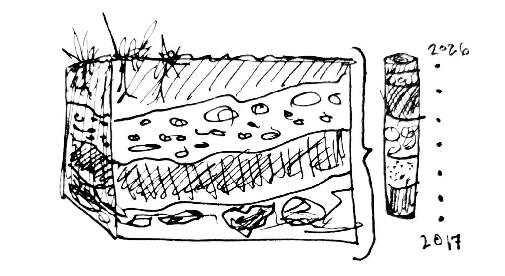

Prospect development job data and information based on academic publications and original research covering jobs posted between 2017 and April 2026. Useful for managers crafting job postings, current analysts curious about the industry landscape, and those seeking to better understand prospect development.

{width=38%}

This is not a comprehensive report, merely expanding my research into career trajectories, skills, job titles, salaries, and other industry information I began [last year](Creating_Jobs_dataset) by exploring the CMAP dataset.

# Overview

---
# References

- 