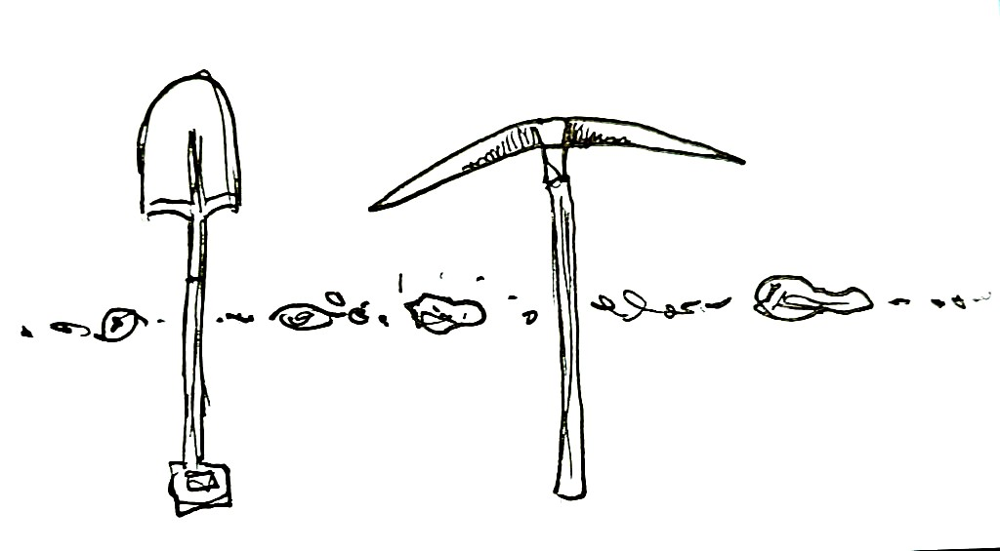
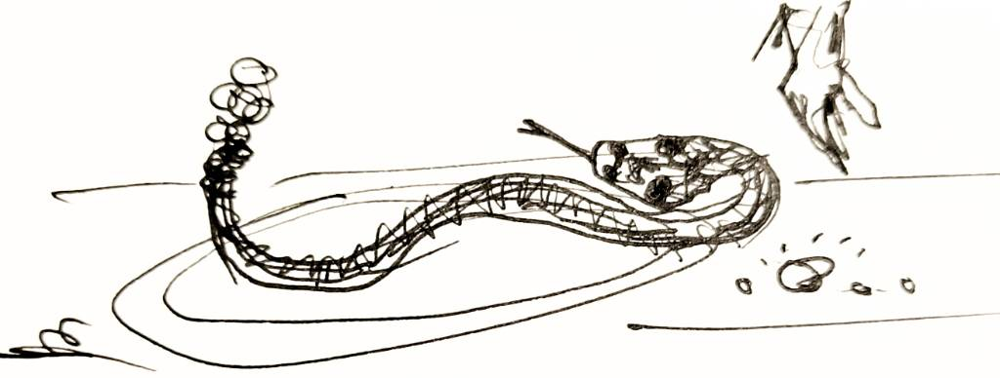

{width=35%}

***
### Howdy, partner! 

This is a working blog hailing from the world of prospect development, management, and research. I'm Greg, a somewhat-less-than-expert fundraising professional, keen to improve as much as I can - at least until the robots replace me. 

First conceived as a fully comprehensive, open-source toolkit, I've finally come to my senses: this is now an eclectic collection of field notes, held together by tongue-in-cheek gold prospecting metaphors.

### My Tale of Woe
I have been frustrated in the past with the lack of widely-accepted methodology or cross-industry comparisons in prospect research. It often feels like webinars are heavy on vendor advertisements and light on technical details. Everything lives behind a paywall - or are geared for leadership, not those of us in the trenches.

{width=35%}

So this is me attempting to document my journey: reviewing tools, mapping out research obstacles or skills, and trying to find anything that helps make the day-to-day work in prospect dev both easier and higher quality. 

### Thanks for stopping by!
For a FAQ and other needlessly long details about this project, feel free to check out the [About](about.qmd) page. Main content of the blog can be found in the [Field Notes](field_notes.qmd).

***

**Version: **

